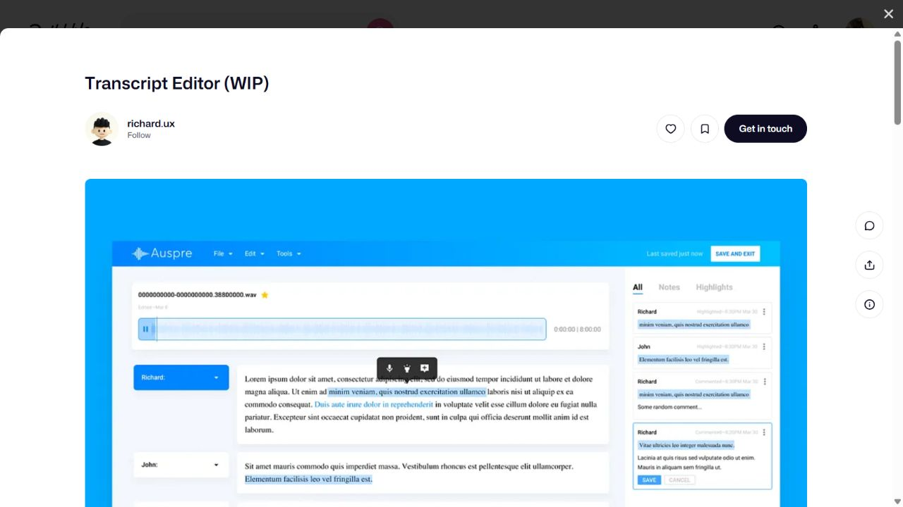
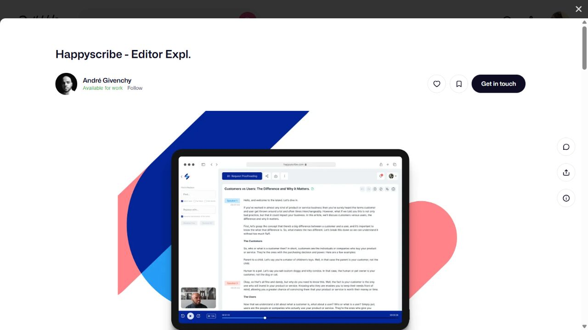
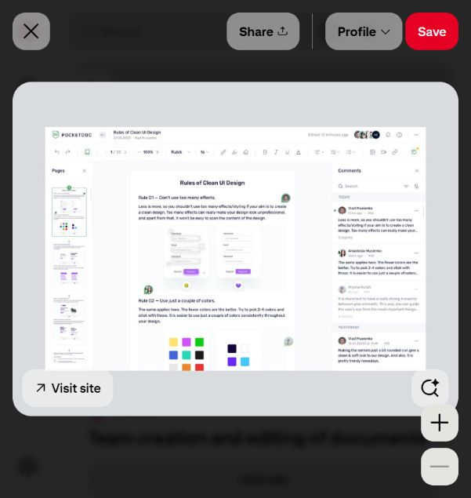
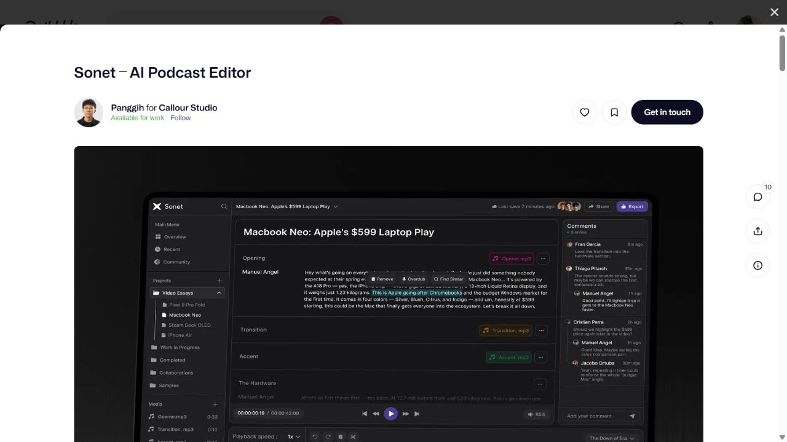
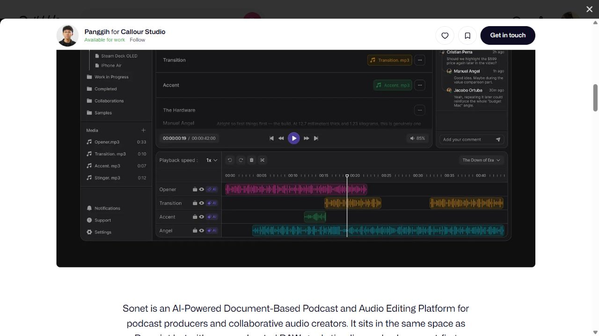
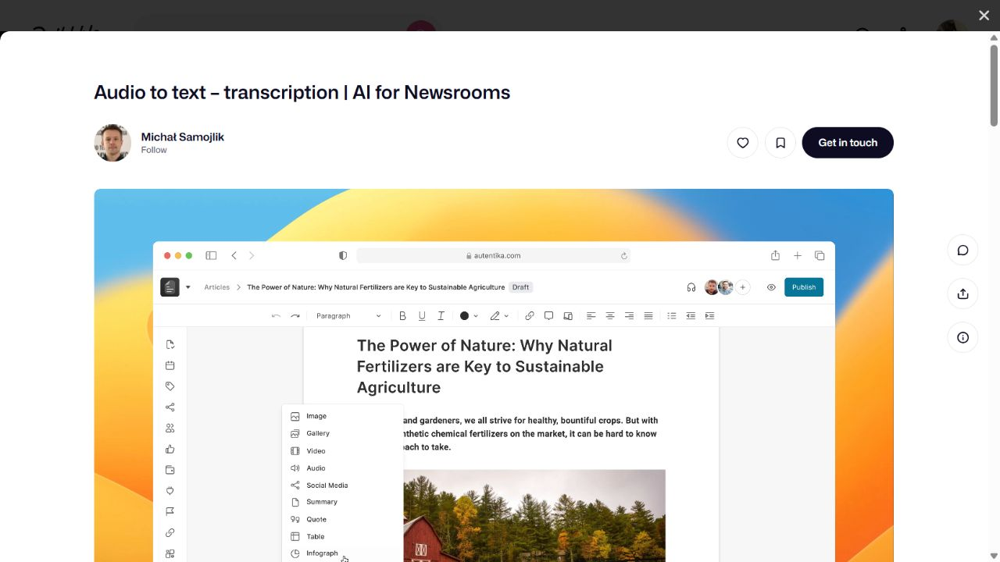
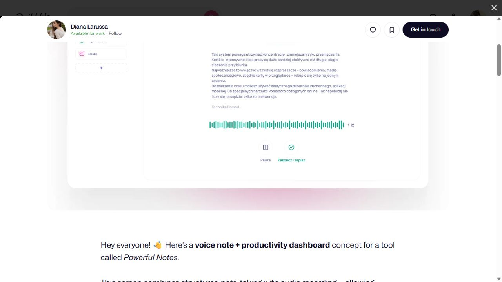

# DLBC design references — director review

30 September 2026. Research and discussion only; no redesign implementation is approved by this document.

## Evidence

The researcher was dispatched as GPT 6 Luna at max effort. It researched Dribbble in its own browser session. The parent collected Pinterest references in the user's existing tab because the two agents did not share the same in-app tabs. The parent directly inspected the saved screenshots below and compared them with the existing DLBC dashboard, setup, and settings captures.

These are design concepts and presentation shots. A screenshot demonstrates a composition, not a working feature, audio synchronisation, save reliability, contrast compliance, keyboard access, or mobile support. Exact font families and icon libraries were not established from appearance. The newsroom screenshots capture frames of an animated presentation; the trigger and production behaviour are unverified. Pinterest references that link to the same Dribbble shot count as one design, not independent corroboration.

## What the comparison tells us

The strongest references give working content the largest share of attention: transcript paragraphs, a document page, and nearby source or review context. The inspected DLBC dashboard instead gives considerable prominence to large capture cards, while setup and settings use separate form/panel treatments. This suggests a useful question for the redesign: can one consistent workspace support capture, verification, and report editing, with each stage changing the emphasis?

This research supports exploring a calm editorial workspace and a contrasting technical audio workspace. It does not establish which direction the user prefers or approve borrowing any exact layout.

| Working context | Strongest candidates | Principle to investigate | Mismatch or missing evidence |
| --- | --- | --- | --- |
| Transcript verification | Transcript Editor (WIP); Happyscribe | Readable speaker-labelled prose, nearby audio, contextual highlights | Correction versus destructive audio editing must stay distinct; mobile, keyboard, and real audio sync unknown |
| Report editing and review | Team creation and editing of documents; newsroom editor | Document-centred layout, compact tools, separate review context | Multi-user collaboration and publishing are outside confirmed scope; source/revisions panel remains a design hypothesis |
| Technical audio workspace | Sonet | Visible playback time, transport controls, separation of prose and audio | This shows editing/playback, not established live capture; multitrack production and AI effects would add unnecessary scope |
| Minimal recording state | Minimal Productivity Dashboard with Audio Recording, Smart Notes | Waveform and elapsed time with a small set of capture controls inside a prose workspace | Voice-note concept; device readiness, long recording, recovery, and actual interaction unknown |
| Session detail hierarchy | Meeting transcription recording details | Source/title/metadata together; related content under tabs | Persistent AI chat and video meetings have no established need here |
| Document navigation | HQ documentation editor | Outline beside the document; compact formatting controls | Cropped presentation and technical API content make it a weaker fit |

## Visual shortlist

### Transcript verification: source context beside prose

[Transcript Editor (WIP), richard.ux](https://dribbble.com/shots/6854685-Transcript-Editor-WIP). Also found through [Pinterest](https://www.pinterest.com/pin/270004940150735849/).

Observed: speaker-labelled paragraph rows, an audio strip, blue text selections, a selection toolbar, and a right-hand All/Notes/Highlights panel. The blue surround is part of the presentation and need not become the app's palette. The design question is how a flagged passage can retain its audio and textual context without overwhelming the reading column.

### Focused transcript reading

[Happyscribe — Editor Expl., André Givenchy](https://dribbble.com/shots/18279598-Happyscribe-Editor-Expl).

Observed: a large transcript column with speaker markers, restrained surrounding controls, a small source preview, and audio transport along the bottom. The presentation device frame limits fine-detail inspection. This is a candidate for studying reading hierarchy and the proximity of playback controls.

### Report review: the document remains central

[Team creation and editing of documents, Vlad Musienko](https://dribbble.com/shots/21535637-Team-creation-and-editing-of-documents), found on [Pinterest](https://www.pinterest.com/pin/314829830215732306/).

Observed: page thumbnails on the left, a centred document, comments on the right, and a compact formatting toolbar. A DLBC exploration could test whether source references or revision history belong in that secondary space. Live collaboration and shared avatars are deferred because they are not confirmed product requirements.

### Contrast: a technical audio workspace

[Sonet — AI Podcast Editor, Panggih for Callour Studio](https://dribbble.com/shots/27215810-Sonet-AI-Podcast-Editor).

Observed: dark panels, a project tree, transcript-like sections, comments, time/speed/transport controls, and coloured multitrack waveforms. It supplies an operational alternative to the light editorial references. Whether dark mode helps during live capture needs operator evidence; the screenshots do not settle that question. DLBC should retain original source audio, so podcast cutting, effects, and multitrack controls are not assumed to transfer.

### Supporting source: document hierarchy

[Audio to text — transcription / AI for Newsrooms, Michał Samojlik](https://dribbble.com/shots/22591046-Audio-to-text-transcription-AI-for-Newsrooms).

Observed: an explicit Draft label, document title, formatting bar, and a contextual insert menu. A second captured frame shows a file-import dialog. Neither frame establishes a complete processing workflow or the app's interaction quality.

### Supporting source: restrained recording controls

[Minimal Productivity Dashboard with Audio Recording, Smart Notes, Diana Larussa](https://dribbble.com/shots/27105938-Minimal-Productivity-Dashboard-with-Audio-Recording-Smart-Notes).

Observed: prose above a waveform, a 1:12 timer, and controls labelled Pauza and Zakończ i zapisz (Pause and Finish/save). The reduced number of controls is a useful contrast with Sonet. This is a voice-note/productivity concept and does not prove microphone readiness, recording reliability, or recovery. Long sermon capture may require additional clearly visible operational state.

## Typography, icons, and motion

The screenshots demonstrate possible relationships between text, controls, and context; they do not identify a suitable font or icon library for DLBC. Evaluate candidate type and icons together on the same realistic DLBC content before selecting them. Compare heading hierarchy, long paragraph readability, label clarity, and stroke/size consistency.

No animation is recommended from a still image. Motion research remains open. Any later prototype should preserve readable still states and complete reduced-motion behaviour. Panel changes and recording-state feedback are useful questions to investigate; decorative movement during verification or report reading needs stronger justification.

## Next useful comparison

Use one realistic sermon session to compare the two candidate directions across transcript verification and report review. Include long titles, a flagged quotation, source context, saved/unsaved revisions, and an unavailable-data state. On narrow screens, the source/review context should remain accessible without squeezing prose into an unreadable column. This is a proposed evaluation, not a production implementation plan.

The current set is stronger for verification and editing than for the actionable dashboard and live recording setup. Those gaps, plus mobile and interactive behaviour, should be the next research targets.

See index.md for the complete source ledger and screenshot inventory.

## Decision following the owner's visual review

The owner rejected the first implementation's oversized intro, numbered capture cards, conventional selected navigation and indistinct icons. Two new built-in image-tool concepts were generated as proposals; they are not additional researched products or implementation evidence.

The owner selected [the light editorial desk](editorial-desk-selected.png) and authorised implementation. Its work list/document/source composition now supplies a concrete visual target. Refine the image with less repeated serif typography, a narrower work list, larger reading area and subordinate YouTube access. Use real session artifacts and honest states; the image's sermons, dates and waveform graphics are synthetic.

[The darker recording desk](recording-desk-alternative.png) is supplementary inspiration for live recording only. Its redundant record indicators and selected left-edge strip should not transfer. Neither still image establishes motion; the implementation must demonstrate navigation, source disclosure and save feedback in the browser. The executable brief is PROJECT_PLAN.md section 12 and tickets T10–T15.
